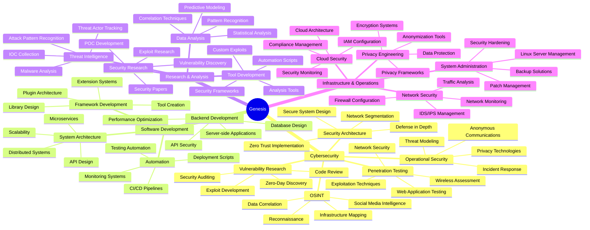

<div align="center">

```ascii
  ██████  ███████ ███    ██ ███████ ███████ ██ ███████ 
 ██       ██      ████   ██ ██      ██      ██ ██      
 ██   ███ █████   ██ ██  ██ █████   ███████ ██ ███████ 
 ██    ██ ██      ██  ██ ██ ██           ██ ██      ██ 
  ██████  ███████ ██   ████ ███████ ███████ ██ ███████ 
```

### Security Researcher • Software Engineer • OSINT Developer

[](mailto:genzt.dev@pm.me)
[]()
[]()

---

</div>

## Current Focus

```python
class Genesis:
    def __init__(self):
        self.role = "Security Researcher & Developer"
        self.location = "Uruguay"
        self.age = 21
        self.status = "Self-taught cybersecurity professional"
        
        self.current_projects = [
            "nexus-intelligence",  # Advanced OSINT Framework
            "calcx-advanced",       # Mathematical Computation Engine
        ]
        
        self.certifications = ["OWASP", "GDPR", "ISO 27001"]
        
        self.learning = [
            "Advanced Exploitation Techniques",
            "Malware Analysis & Reverse Engineering", 
            "Cloud Security Architecture",
            "Network Protocol Analysis",
            "Cryptographic Systems"
        ]
        
        self.goals_2025 = [
            "Expand OSINT framework capabilities",
            "Contribute to security research community",
            "Build enterprise-grade security tools",
            "Publish security research papers",
            "Develop advanced threat detection systems"
        ]
    
    def get_expertise(self):
        return {
            "cybersecurity": [
                "Open Source Intelligence (OSINT)",
                "Penetration Testing",
                "Security Architecture",
                "Vulnerability Research",
                "Operational Security (OpSec)",
                "Network Security Analysis",
                "Web Application Security"
            ],
            "development": [
                "System Design & Architecture",
                "API Development & Integration",
                "Automation Engineering",
                "Framework Development",
                "Performance Optimization",
                "Database Design",
                "DevOps Practices"
            ],
            "specialties": [
                "Intelligence Gathering",
                "Data Analysis & Correlation",
                "Threat Intelligence",
                "Security Tool Development",
                "Infrastructure Hardening"
            ]
        }
    
    def professional_interests(self):
        return [
            "Building scalable security solutions",
            "Contributing to open-source security projects",
            "Researching emerging threats and vulnerabilities",
            "Developing automated security testing frameworks",
            "Advancing privacy-preserving technologies"
        ]
```

---

## Technical Arsenal

<div align="center">

### Programming Languages


### Security Tools & Frameworks


### Web & API Technologies


### Infrastructure & DevOps


### Databases & Caching


### Privacy & Security Infrastructure


### Cloud & Hosting


</div>

---

## Featured Projects

<div align="center">

<table>
<tr>
<td width="50%" valign="top">

### [Nexus Intelligence](https://github.com/genesisgzdev/nexus-intelligence)

**Advanced OSINT Framework for Security Professionals**

A modular open-source intelligence gathering framework designed for security professionals and researchers. Built with enterprise-grade architecture implementing responsible disclosure practices and comprehensive operational security measures.

**Core Capabilities:**
- Multi-platform reconnaissance across 350+ social platforms
- Advanced OpSec with proxy support and TLS fingerprinting
- GitHub intelligence extraction with commit history analysis
- Social media correlation and identity verification
- DNS enumeration and infrastructure analysis
- SSL/TLS certificate chain inspection
- Automated correlation engine for cross-referencing data
- Email validation and breach correlation
- Phone number format validation
- WHOIS data parsing with registrar information

**Architecture Highlights:**
- HTTP engine with resilient request handling
- Automatic retry mechanisms with exponential backoff
- Connection pooling for request reuse
- Concurrent processing with configurable worker threads
- Memory-efficient streaming for large dataset handling
- Pluggable module system for independent execution
- Request throttling with platform-specific delays
- User agent rotation with 50+ browser signatures
- Request header randomization

**Technology Stack:**
`Python` `Beautiful Soup` `Docker` `REST APIs` `Threading` `Regex` `JSON/CSV/XML Export`

**Security Features:**
- Proxy support (HTTP, HTTPS, SOCKS4, SOCKS5)
- TLS fingerprint randomization
- Cookie jar management with session persistence
- Rate limiting to prevent detection
- Comprehensive input validation
- Secure data handling practices

[](https://github.com/genesisgzdev/nexus-intelligence)

</td>
<td width="50%" valign="top">

### [CalcX Advanced](https://github.com/genesisgzdev/calcx-advanced)

**Professional-Grade Mathematical Computation Engine**

Enterprise-level computation tool delivering arbitrary precision arithmetic through an elegant command-line interface. Built for researchers, engineers, and professionals requiring accurate numerical analysis and complex mathematical operations.

**Core Features:**
- Arbitrary precision arithmetic via GNU bc backend
- Matrix operations including determinants and inversions
- Numerical integration using Simpson's rule
- Complex number operations in rectangular and polar forms
- Discrete Fourier transforms for signal processing
- Root finding with Newton-Raphson iteration
- Solving quadratic and cubic equations
- Statistical analysis (mean, median, variance, standard deviation)
- Combinatorics (permutations, combinations, factorial)
- Base conversion (binary, octal, decimal, hexadecimal)
- Number theory utilities (prime factorization, GCD, LCM)

**Technical Implementation:**
- 2500+ lines of optimized Bash and Python code
- Layered architecture separating computation, interface, and persistence
- Dual-mode operation: command-line and interactive shell
- Persistent calculation history with file storage
- Comprehensive input validation with regex patterns
- Graceful error handling and recovery
- POSIX-compliant for maximum portability

**Performance Characteristics:**
- Sub-second execution for standard operations
- Calculations up to 10^308 magnitude
- Memory footprint under 50MB during active computation
- Efficient array management for history
- Optimized for numerical stability

**Technology Stack:**
`Bash` `Python` `GNU bc` `awk` `POSIX Shell` `Math Libraries`

**Use Cases:**
- Academic research and validation
- Engineering design calculations
- Scientific computing workflows
- System administration utilities
- Educational exploration of numerical methods

[](https://github.com/genesisgzdev/calcx-advanced)

</td>
</tr>
</table>

</div>

---

## Development Activity

<div align="center">


</div>

<div align="center">

### Most Used Languages


</div>

---

## Technical Expertise

### Cybersecurity Domains

**Open Source Intelligence (OSINT)**
- Advanced reconnaissance techniques across multiple platforms
- Social media intelligence gathering and analysis
- Infrastructure mapping and network topology discovery
- Digital footprint analysis and correlation
- Automated intelligence collection frameworks
- Data mining and pattern recognition
- OSINT tool development and customization

**Penetration Testing & Vulnerability Assessment**
- Web application security testing (OWASP Top 10)
- Network penetration testing and exploitation
- Wireless security assessments
- Social engineering techniques
- Privilege escalation methods
- Post-exploitation strategies
- Comprehensive reporting and documentation

**Security Architecture & Design**
- Secure system design principles
- Defense-in-depth strategies
- Zero-trust architecture implementation
- Network segmentation and isolation
- Access control and authentication systems
- Encryption and cryptographic implementations
- Security policy development

**Operational Security (OpSec)**
- Privacy-preserving technologies and practices
- Anonymous communication channels
- Secure data handling and storage
- Anti-forensics techniques
- Threat modeling and risk assessment
- Security monitoring and incident detection
- Digital identity management

### Software Development Expertise

**System Architecture & Design**
- Microservices architecture patterns
- RESTful API design and implementation
- Event-driven architecture
- Message queue systems
- Distributed systems design
- Scalability and load balancing
- High-availability systems

**Backend Development**
- Server-side application development
- Database design and optimization
- API security and authentication
- Caching strategies and implementation
- Background job processing
- WebSocket implementations
- GraphQL schema design

**Automation & DevOps**
- CI/CD pipeline development
- Infrastructure as Code (IaC)
- Configuration management
- Automated testing frameworks
- Deployment automation
- Monitoring and alerting systems
- Log aggregation and analysis

**Security Engineering**
- Secure coding practices
- Input validation and sanitization
- Authentication and authorization systems
- Cryptographic implementations
- Security testing automation
- Vulnerability scanning and remediation
- Security audit and compliance

---

## Areas of Expertise

<div align="center">



</div>

---

## Professional Certifications

<div align="center">

| Certification | Status | Domain | Year |
|--------------|--------|---------|------|
| **OWASP Certification** | Certified | Web Application Security | 2024 |
| **GDPR Compliance** | Certified | Data Privacy & Protection | 2024 |
| **ISO 27001** | Certified | Information Security Management | 2024 |

### Continuous Learning Path

Currently expanding expertise in:
- Advanced malware analysis and reverse engineering
- Cloud security architecture and implementation
- Zero-day vulnerability research
- Advanced persistent threat (APT) detection
- Machine learning for security applications
- Blockchain security and smart contract auditing
- Container security and Kubernetes hardening
- Hardware security and firmware analysis

</div>

---

## Development Philosophy

<div align="center">

> *"Quality over quantity. Every line of code matters, every security measure counts."*

> *"Security is not a product, but a process. It's about building trust through transparency and responsibility."*

> *"The best security tools are those that empower users while respecting their privacy."*

</div>

### Core Principles

```yaml
engineering_approach:
  code_quality:
    - "Write production-grade code from inception"
    - "Prioritize readability and maintainability"
    - "Implement comprehensive testing strategies"
    - "Document for future developers and users"
    - "Follow industry best practices and standards"
  
  architecture:
    - "Design for scalability from the start"
    - "Build modular and extensible systems"
    - "Implement proper error handling and logging"
    - "Optimize for performance without sacrificing security"
    - "Create reusable and composable components"

security_mindset:
  principles:
    - "Security by design, not as an afterthought"
    - "Defense in depth across all layers"
    - "Principle of least privilege"
    - "Fail securely and gracefully"
    - "Assume breach mentality"
  
  practices:
    - "Regular security audits and code reviews"
    - "Continuous vulnerability assessment"
    - "Timely patching and updates"
    - "Secure configuration management"
    - "Incident response preparedness"

ethical_standards:
  disclosure:
    - "Responsible disclosure always"
    - "Never exploit without authorization"
    - "Report vulnerabilities to vendors"
    - "Allow reasonable time for fixes"
    - "Protect user data and privacy"
  
  research:
    - "Respect privacy and boundaries"
    - "Follow legal and ethical guidelines"
    - "Obtain proper authorization"
    - "Consider societal impact"
    - "Share knowledge responsibly"

collaboration:
  open_source:
    - "Contribute to community projects"
    - "Share knowledge and tools"
    - "Mentor aspiring security professionals"
    - "Participate in security discussions"
    - "Support ethical hacking initiatives"
  
  professional:
    - "Build long-term partnerships"
    - "Communicate clearly and effectively"
    - "Deliver on commitments"
    - "Accept constructive feedback"
    - "Continuously improve skills"

future_goals:
  short_term:
    - "Expand Nexus Intelligence capabilities"
    - "Publish security research papers"
    - "Contribute to major open-source security projects"
    - "Build advanced threat detection systems"
    - "Develop automated security testing frameworks"
  
  long_term:
    - "Establish myself in international cybersecurity community"
    - "Lead security research initiatives"
    - "Develop enterprise security solutions"
    - "Mentor next generation of security researchers"
    - "Advance privacy-preserving technologies"
```

---

## Technical Writing & Documentation

I believe in comprehensive documentation as a fundamental aspect of professional software development. All projects include:

**Documentation Standards:**
- Clear README files with setup instructions
- Comprehensive API documentation
- Architecture decision records (ADRs)
- Inline code comments for complex logic
- Usage examples and tutorials
- Security considerations and best practices
- Troubleshooting guides
- Contributing guidelines

**Technical Communication:**
- Writing clear and concise technical documentation
- Creating detailed security advisories
- Producing vulnerability reports
- Developing user guides and tutorials
- Publishing technical blog posts
- Presenting at security conferences
- Sharing knowledge through workshops

---

## Security Research Interests

### Current Research Areas

**OSINT Methodology Development**
- Automated intelligence gathering techniques
- Cross-platform correlation algorithms
- Privacy-preserving reconnaissance methods
- Real-time threat intelligence collection
- Open-source tool development

**Web Application Security**
- Modern web framework vulnerabilities
- API security best practices
- Authentication and authorization flaws
- Client-side security issues
- Server-side request forgery (SSRF)
- Cross-site scripting (XSS) variants

**Network Security**
- Advanced network reconnaissance
- Protocol analysis and exploitation
- Wireless security research
- Network segmentation strategies
- Intrusion detection evasion techniques

**Privacy Technologies**
- Anonymous communication systems
- Traffic analysis resistance
- Metadata protection techniques
- Privacy-preserving protocols
- Encrypted communication channels

### Research Methodology

- Systematic vulnerability discovery
- Proof-of-concept development
- Responsible disclosure process
- Collaboration with security community
- Publishing findings and tools
- Continuous learning and adaptation

---

## Connect & Collaborate

<div align="center">

### Professional Collaboration Opportunities

[](mailto:genzt.dev@pm.me)
[](mailto:genzt.dev@pm.me)

**Open to Collaboration On:**
- Open-source security tool development
- Security research projects and papers
- Vulnerability discovery and responsible disclosure
- Security framework architecture and design
- OSINT methodology development
- Privacy-preserving technology implementation
- Security training and workshops
- Technical writing and documentation
- Freelance security consulting
- Bug bounty programs

**Areas of Interest:**
- Advanced persistent threat (APT) research
- Zero-day vulnerability discovery
- Security automation and orchestration
- Threat intelligence platforms
- Incident response systems
- Security tool development
- Privacy technology advancement
- Open-source security contributions

</div>

---

## Contribution Activity

<div align="center">


</div>

---

## Security & Legal Notice

<div align="center">

### Responsible Use Policy

**All tools, code, and projects shared in this repository are intended exclusively for:**

**Authorized Activities:**
- Authorized security assessments with explicit written permission
- Educational purposes in controlled environments
- Ethical security research with proper authorization
- Bug bounty programs within defined scope and rules
- Personal infrastructure testing with ownership
- Professional security consulting engagements
- Academic research with institutional approval
- Defensive security implementations

**Compliance Requirements:**
- Obtain explicit authorization before any security testing
- Comply with all applicable laws and regulations
- Respect terms of service of all platforms
- Follow responsible disclosure practices
- Protect sensitive information appropriately
- Maintain proper documentation of activities
- Report vulnerabilities through proper channels

**Strictly Prohibited Uses:**
- Unauthorized access to computer systems
- Malicious activities of any kind
- Privacy violations or surveillance
- Illegal operations or criminal activities
- Harassment, stalking, or intimidation
- Commercial espionage or corporate theft
- Identity theft or fraud
- Violation of terms of service

### Legal Disclaimer

THE SOFTWARE AND TOOLS PROVIDED ARE FOR EDUCATIONAL AND AUTHORIZED TESTING PURPOSES ONLY. THE AUTHOR ASSUMES NO LIABILITY FOR MISUSE OR DAMAGES CAUSED BY THESE TOOLS. USERS ARE SOLELY RESPONSIBLE FOR ENSURING COMPLIANCE WITH ALL APPLICABLE LAWS AND REGULATIONS IN THEIR JURISDICTION.

By using any tools or code from this repository, you agree to:
- Use them only for legal and ethical purposes
- Obtain proper authorization before use
- Comply with all applicable laws and regulations
- Accept full responsibility for your actions
- Indemnify the author from any liability

### Privacy & Data Protection

All projects respect user privacy and comply with:
- GDPR (General Data Protection Regulation)
- CCPA (California Consumer Privacy Act)
- Other applicable privacy laws and regulations

Security research and tool development prioritize:
- Privacy by design principles
- Data minimization practices
- Secure data handling
- User consent and transparency
- Right to be forgotten

</div>

---

## Technical Skills Matrix

<div align="center">

| Category | Technologies | Proficiency Level |
|----------|-------------|-------------------|
| **Programming** | Python, C, C++, C#, Go | Advanced |
| **Scripting** | Bash, Ruby, Assembly | Advanced |
| **Web Development** | JavaScript, TypeScript, Next.js | Advanced |
| **Security Testing** | Metasploit, Burp Suite, OWASP ZAP | Expert |
| **OSINT** | Reconnaissance, Data Mining, Analysis | Expert |
| **Network Security** | Wireshark, Nmap, Aircrack-ng | Advanced |
| **Penetration Testing** | Web Apps, Networks, Wireless | Advanced |
| **Cryptography** | Encryption, Hashing, PKI | Advanced |
| **Databases** | PostgreSQL, MySQL, MongoDB, Redis | Advanced |
| **DevOps** | Docker, Kubernetes, CI/CD | Intermediate |
| **Cloud Platforms** | AWS, GCP, DigitalOcean | Intermediate |
| **Operating Systems** | Linux, Unix, Windows | Expert |
| **Privacy Tools** | Tor, VPN, Encryption Tools | Expert |

</div>

---

## Project Development Approach

### Planning & Architecture
1. Requirements analysis and documentation
2. Threat modeling and security considerations
3. System architecture design
4. Technology stack selection
5. Development roadmap creation

### Implementation
1. Modular code structure with clear separation of concerns
2. Test-driven development (TDD) practices
3. Continuous integration and automated testing
4. Code review and quality assurance
5. Security-first implementation approach

### Documentation
1. Comprehensive README with setup instructions
2. API documentation and usage examples
3. Architecture decision records
4. Security considerations and best practices
5. Contributing guidelines and code of conduct

### Testing & Quality Assurance
1. Unit testing for individual components
2. Integration testing for system interactions
3. Security testing and vulnerability assessment
4. Performance testing and optimization
5. User acceptance testing

### Deployment & Maintenance
1. Containerization for portability
2. CI/CD pipeline automation
3. Monitoring and logging implementation
4. Regular security updates and patches
5. Community feedback integration

---

<div align="center">


**Star repositories if you find them useful • Fork and contribute • Reach out for collaboration**

---

*Last Updated: November 2024*

**Genesis • Security Research • Open Source • Privacy First**

*Dedicated to building secure, privacy-respecting tools for the cybersecurity community*

</div>
