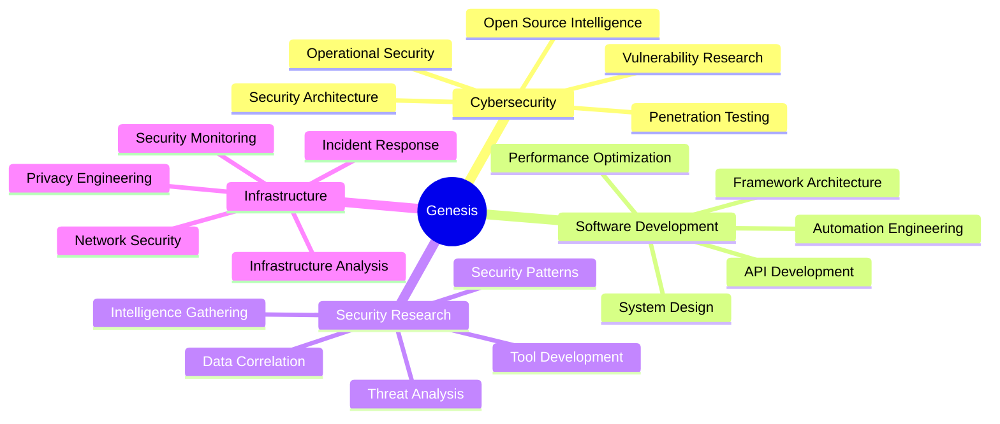

<div align="center">

```ascii
  ██████  ███████ ███    ██ ███████ ███████ ██ ███████ 
 ██       ██      ████   ██ ██      ██      ██ ██      
 ██   ███ █████   ██ ██  ██ █████   ███████ ██ ███████ 
 ██    ██ ██      ██  ██ ██ ██           ██ ██      ██ 
  ██████  ███████ ██   ████ ███████ ███████ ██ ███████ 
```

### Security Researcher · Software Engineer · OSINT Developer

[](mailto:genzt.dev@pm.me)
[]()

---

</div>

## About Me

```python
class Genesis:
    def __init__(self):
        self.role = "Security Researcher & Software Developer"
        self.location = "Uruguay"
        self.age = 21
        self.focus = "Cybersecurity, OSINT, and Security Tool Development"
        self.certifications = ["OWASP", "GDPR", "ISO 27001"]
        
    def current_projects(self):
        return {
            "nexus_intelligence": "Advanced OSINT framework for security professionals",
            "calcx_advanced": "Professional-grade mathematical computation engine"
        }
    
    def expertise(self):
        return {
            "security": [
                "Open Source Intelligence (OSINT)",
                "Penetration Testing",
                "Security Architecture",
                "Vulnerability Research",
                "Operational Security"
            ],
            "development": [
                "System Design",
                "API Development",
                "Framework Architecture",
                "Automation Engineering",
                "Performance Optimization"
            ]
        }
```

---

## Technical Stack

### Programming Languages


### Security Tools & Frameworks


### Infrastructure & DevOps


### Privacy & Security Infrastructure


---

## Featured Projects

### [Nexus Intelligence](https://github.com/genesisgzdev/nexus-intelligence)

**Advanced OSINT Framework for Security Professionals**

A modular open-source intelligence gathering framework implementing enterprise-grade architecture with responsible disclosure practices and operational security measures.

**Core Capabilities:**
- Multi-platform reconnaissance across 350+ platforms
- GitHub intelligence extraction with commit history analysis
- Infrastructure analysis including DNS enumeration and SSL/TLS certificate inspection
- Social media correlation and identity verification
- Advanced operational security with TLS fingerprint randomization

**Architecture:**
- Concurrent request processing with configurable worker threads
- Memory-efficient streaming for large dataset handling
- Exponential backoff retry mechanisms with automatic failover
- Request throttling and connection pooling
- Pluggable module system for independent execution

**Technology:** Python, Beautiful Soup, Docker, Threading, REST APIs

---

### [CalcX Advanced](https://github.com/genesisgzdev/calcx-advanced)

**Professional-Grade Mathematical Computation Engine**

Enterprise-level computation tool delivering arbitrary precision arithmetic through an elegant command-line interface. Built for researchers, engineers, and professionals requiring accurate numerical analysis.

**Key Features:**
- Arbitrary precision arithmetic via GNU bc backend
- Matrix operations including determinants and inversions
- Numerical integration using Simpson's rule
- Complex number operations in rectangular and polar forms
- Discrete Fourier transforms for signal processing

**Performance:**
- Sub-second execution for standard operations
- Calculations up to 10^308 magnitude
- Memory footprint under 50MB during active computation
- Optimized for numerical stability over microsecond-level performance

**Technology:** Bash, Python, GNU bc, awk, POSIX-compliant architecture

---

## GitHub Statistics

<div align="center">


</div>

<div align="center">

### Language Distribution


</div>

---

## Areas of Expertise



---

## Professional Certifications

| Certification | Status | Domain |
|--------------|--------|---------|
| OWASP | Certified | Web Application Security |
| GDPR | Certified | Data Privacy & Compliance |
| ISO 27001 | Certified | Information Security Management |
| UTU Cybersecurity Program | Planned 2026 | Formal Security Education |

---

## Development Philosophy

> **"Quality over quantity. Every line of code matters, every security measure counts."**

### Core Principles

**Engineering Approach:**
- Write production-grade code from inception
- Security by design, not as an afterthought
- Documentation prepared for senior-level review
- Build solutions that address real-world problems

**Security Ethics:**
- Responsible disclosure in all circumstances
- Authorization required before any security assessment
- Privacy and boundaries respected unconditionally
- Knowledge sharing benefits the entire community

**Professional Goals:**
- Expand open-source security toolkit
- Contribute meaningfully to security research community
- Develop enterprise-grade security solutions
- Emigrate to Canada by 2029 for advanced opportunities in cybersecurity

---

## Contact

**Professional Inquiries:**

[](mailto:genzt.dev@pm.me)

**Open to:**
- Open-source collaboration
- Security research partnerships
- Tool development projects
- Professional consulting
- Freelance security work

---

## Contribution Activity

<div align="center">


</div>

---

## Legal & Ethical Notice

**All tools and projects are intended exclusively for:**
- Authorized security assessments with explicit permission
- Educational purposes within legal frameworks
- Ethical research with proper authorization
- Bug bounty programs within defined scope
- Personal verification with informed consent

**Prohibited uses:**
- Unauthorized system access
- Malicious activities of any kind
- Privacy violations
- Any illegal operations

All users bear full responsibility for ensuring compliance with applicable laws and regulations in their jurisdiction, including computer fraud statutes, data protection regulations, and privacy laws.

---

<div align="center">


---

**Genesis** | Security Research | Open Source | Privacy First

*Last Updated: November 2024*

</div>
