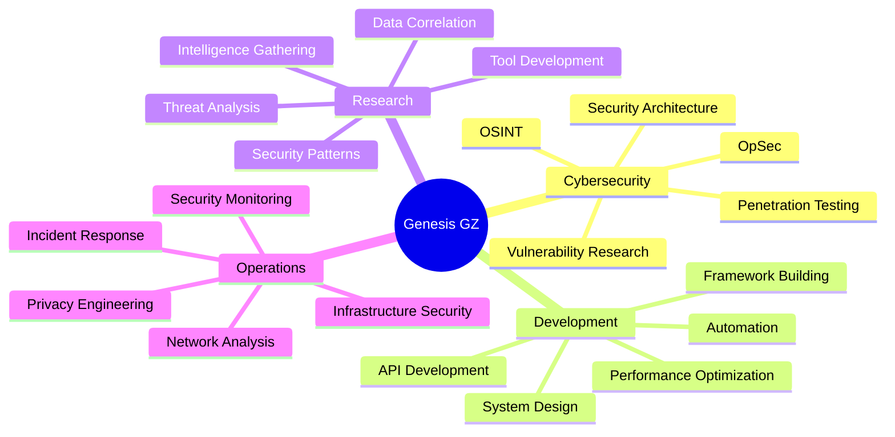

<div align="center">

```ascii
  ██████  ███████ ███    ██ ███████ ███████ ██ ███████     ██████  ███████ 
 ██       ██      ████   ██ ██      ██      ██ ██         ██       ██      
 ██   ███ █████   ██ ██  ██ █████   ███████ ██ ███████    ██   ███ ███████ 
 ██    ██ ██      ██  ██ ██ ██           ██ ██      ██    ██    ██      ██ 
  ██████  ███████ ██   ████ ███████ ███████ ██ ███████     ██████  ███████ 
```

### Security Researcher • Software Engineer • OSINT Developer

[](mailto:genzt.dev@pm.me)
[]()
[]()

---

</div>

## 🎯 Current Focus

```python
class GenesisGZ:
    def __init__(self):
        self.role = "Security Researcher & Developer"
        self.location = "Uruguay 🇺🇾"
        self.current_projects = [
            "nexus-intelligence",  # Advanced OSINT Framework
            "calcx-advanced",       # Mathematical Computation Engine
        ]
        self.certifications = ["OWASP", "GDPR", "ISO 27001"]
        self.learning = ["Advanced Exploitation", "Malware Analysis", "Cloud Security"]
        self.goals_2025 = [
            "Expand OSINT framework capabilities",
            "Contribute to security research community",
            "Build enterprise-grade security tools"
        ]
    
    def get_expertise(self):
        return {
            "cybersecurity": ["OSINT", "Penetration Testing", "Security Architecture"],
            "development": ["System Design", "API Development", "Automation"],
            "specialties": ["Intelligence Gathering", "Data Analysis", "OpSec"]
        }
```

---

## 🛠️ Technical Arsenal

<div align="center">

### Languages & Frameworks


### Security & Intelligence


### Infrastructure & Tools


### Privacy & Security Stack


</div>

---

## 🚀 Featured Projects

<div align="center">

<table>
<tr>
<td width="50%" valign="top">

### 🔍 [Nexus Intelligence](https://github.com/genesisgzdev/nexus-intelligence)

**Advanced OSINT Framework**

A modular intelligence gathering framework designed for security professionals. Built with enterprise-grade architecture implementing responsible disclosure and operational security.

**Key Features:**
- 🌐 Multi-platform reconnaissance (350+ sites)
- 🔒 Advanced OpSec with proxy support
- 📊 GitHub intelligence & social media analysis
- 🛡️ DNS enumeration & infrastructure analysis
- 🎯 Automated correlation engine

**Tech Stack:**
`Python` `Beautiful Soup` `Docker` `REST APIs` `Threading`

**Highlights:**
- Concurrent processing with configurable workers
- Memory-efficient streaming for large datasets
- TLS fingerprint randomization
- Exponential backoff retry mechanisms

[](https://github.com/genesisgzdev/nexus-intelligence)

</td>
<td width="50%" valign="top">

### 🧮 [CalcX Advanced](https://github.com/genesisgzdev/calcx-advanced)

**Professional Mathematical Engine**

Enterprise-grade computation engine delivering arbitrary precision arithmetic through an elegant CLI. Battle-tested for research and engineering calculations.

**Key Features:**
- ∞ Arbitrary precision via GNU bc
- 📐 Matrix operations & inversions
- 📈 Numerical integration (Simpson's rule)
- 🔢 Complex number operations
- 🎲 Discrete Fourier transforms

**Tech Stack:**
`Bash` `Python` `GNU bc` `awk` `POSIX`

**Highlights:**
- Sub-second execution for standard ops
- Calculations up to 10^308 magnitude
- Persistent history management
- 2500+ lines of optimized code

[](https://github.com/genesisgzdev/calcx-advanced)

</td>
</tr>
</table>

</div>

---

## 📊 Development Activity

<div align="center">


</div>

<div align="center">

### 💻 Most Used Languages


</div>

---

## 🏆 Expertise Domains

<div align="center">



</div>

---

## 🎓 Certifications & Learning

<div align="center">

| Certification | Status | Focus Area |
|--------------|--------|------------|
| **OWASP** | ✅ Certified | Web Application Security |
| **GDPR** | ✅ Certified | Data Privacy & Compliance |
| **ISO 27001** | ✅ Certified | Information Security Management |
| **UTU Cybersecurity** | 🎯 Planned 2026 | Formal Security Education |

</div>

---

## 💼 Professional Philosophy

<div align="center">

> *"Quality over quantity. Every line of code matters, every security measure counts."*

> *"Tiempo al paso, nadie es fracasado" — Time at its pace, no one is a failure*

</div>

### Core Values

```yaml
approach:
  - "Write production-grade code from day one"
  - "Security by design, not as afterthought"
  - "Document like senior engineers will review"
  - "Build tools that solve real problems"

ethics:
  - "Responsible disclosure always"
  - "Never exploit without authorization"
  - "Respect privacy and boundaries"
  - "Knowledge sharing benefits everyone"

goals:
  short_term:
    - "Expand open-source security toolkit"
    - "Build stronger public presence"
    - "Contribute to security community"
  long_term:
    - "Emigrate to Canada (2029)"
    - "Join elite security research team"
    - "Develop enterprise security solutions"
```

---

## 📫 Connect & Collaborate

<div align="center">

### Let's Build Something Secure Together

[](mailto:genzt.dev@pm.me)
[](mailto:genzt.dev@pm.me)

**Interested in:**
- 🤝 Open-source collaboration
- 🔒 Security research partnerships
- 💡 Tool development projects
- 📚 Knowledge exchange
- 🌐 Freelance security work

</div>

---

## 📈 Contribution Activity

<div align="center">


</div>

---

## 🔐 Security Notice

<div align="center">

**All tools and projects shared here are intended for:**
- ✅ Authorized security assessments
- ✅ Educational purposes
- ✅ Ethical research with proper authorization
- ✅ Bug bounty programs within scope
- ✅ Personal verification with consent

**Never for:**
- ❌ Unauthorized access
- ❌ Malicious activities
- ❌ Privacy violations
- ❌ Illegal operations

*Use responsibly. Get authorization. Respect privacy. Follow the law.*

</div>

---

<div align="center">

### 💡 Fun Facts About Me

```javascript
const genesis = {
    age: 21,
    location: "🇺🇾 Uruguay",
    role: "Legal Guardian & Tech Professional",
    quirks: [
        "Overdresses in formal business attire for mundane activities",
        "Runs social experiments as hobby",
        "Self-taught cybersecurity pro",
        "Owns a Siamese cat 🐱",
        "100% success rate in banking disputes"
    ],
    philosophy: "Perfectionist who values timing and growth",
    future: "Building path to Canada 2029 🇨🇦"
};
```

</div>

---

<div align="center">


**⭐ Star my repos if you find them useful • 🍴 Fork and contribute • 📧 Reach out for collaborations**

---

*Last Updated: November 2024*

**Built with 💚 by Genesis GZ • Security Research • Open Source • Privacy First**

</div>
